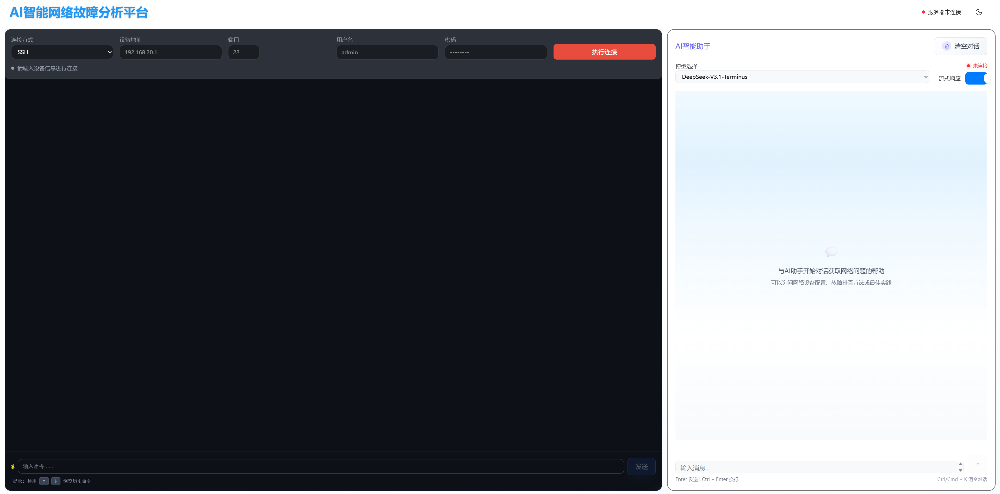
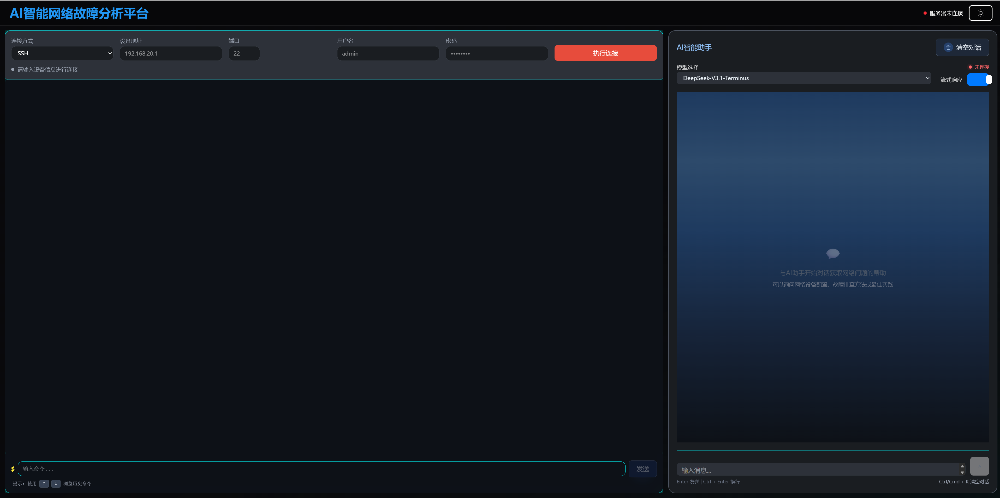

# AI智能网络故障分析平台

本项目是一个结合AI与网络管理的智能平台，用于连接网络设备并提供AI辅助的故障分析功能。系统支持多种大语言模型（Claude、GPT、Deepseek等）进行智能分析，提供流式响应界面，实现实时网络设备连接和命令执行。

## 前端界面预览

### 默认界面


### dark界面


## 项目结构

项目由前端和后端两部分组成：

### 前端结构 (Vue 3.5+ + TypeScript 5.8+)

```
frontend/
├── .vscode/                    # VS Code配置
├── lib/                        # 第三方库和工具
│   └── utils.ts               # 通用工具函数
├── public/                     # 公共静态资源
├── src/                        # 源代码目录
│   ├── assets/                # 静态资源和样式
│   │   └── main.css          # 主要样式文件
│   ├── components/            # Vue组件目录
│   │   ├── ai-assistant/      # AI助手功能模块
│   │   │   ├── AIAssistant.vue         # AI聊天主界面组件
│   │   │   └── components/             # AI助手子组件
│   │   │       ├── ChatHeader.vue      # 聊天头部组件
│   │   │       ├── ChatInput.vue       # 消息输入组件
│   │   │       ├── ChatMessages.vue    # 消息显示组件
│   │   │       ├── ModelSelector.vue   # 模型选择器
│   │   │       ├── StreamToggle.vue    # 流式开关组件
│   │   │       └── index.ts            # 组件统一导出
│   │   ├── terminal/                   # 网络终端模块
│   │   │   └── NetworkTerminal.vue     # 网络设备连接终端
│   │   ├── common/                     # 通用组件
│   │   │   ├── ServerStatusIndicator.vue # 服务器状态指示器
│   │   │   └── icons/                  # 图标组件集合
│   │   │       ├── SunIcon.vue         # 太阳图标（浅色主题）
│   │   │       ├── MoonIcon.vue        # 月亮图标（深色主题）
│   │   │       ├── SendIcon.vue        # 发送图标
│   │   │       ├── ClearIcon.vue       # 清除图标
│   │   │       ├── ConnectIcon.vue     # 连接图标
│   │   │       ├── DisconnectIcon.vue  # 断开图标
│   │   │       └── index.ts            # 图标统一导出
│   │   └── ui/                         # UI组件库
│   │       ├── CardSpotlight.vue       # 聚光灯卡片组件
│   │       ├── FloatingParticlesBackground.vue # 浮动粒子背景
│   │       ├── RippleButton.vue        # 涟漪按钮组件
│   │       └── ShimmerButton.vue       # 闪光按钮组件
│   ├── layouts/                        # 布局组件
│   │   └── MainLayout.vue             # 主布局组件
│   ├── stores/                         # Pinia状态管理
│   │   ├── ai-assistant/              # AI助手状态模块
│   │   │   └── actions/
│   │   │       └── storage.ts         # 存储相关操作
│   │   ├── aiAssistant.ts             # AI助手状态管理
│   │   ├── terminal.ts                # 终端会话状态管理
│   │   └── app.ts                     # 应用全局状态管理
│   ├── types/                         # TypeScript类型定义
│   │   ├── index.ts                   # 主要类型定义
│   │   └── chat.ts                    # 聊天相关类型
│   ├── utils/                         # 工具函数
│   │   ├── aiService.ts              # AI服务工具
│   │   ├── terminalService.ts        # 终端服务工具
│   │   ├── localStorageUtils.ts      # 本地存储工具
│   │   └── helpers.ts                # 通用辅助函数
│   ├── App.vue                        # 应用根组件
│   ├── main.ts                        # 应用入口文件
│   ├── style.css                      # 全局样式
│   └── vite-env.d.ts                 # Vite环境类型声明
├── index.html                          # HTML入口文件
├── package.json                        # 项目依赖配置
├── package-lock.json                   # 依赖锁定文件
├── eslint.config.js                    # ESLint配置
├── postcss.config.js                   # PostCSS配置
├── tsconfig.json                       # TypeScript配置
└── vite.config.ts                      # Vite构建配置
```

### 后端结构 (FastAPI 0.115+ + Python 3.9+)

```
backend/
├── app/                        # 主应用目录
│   ├── api/                    # API路由层
│   │   ├── api_v1/            # V1版本API
│   │   │   ├── api.py         # API路由汇总
│   │   │   └── endpoints/      # API端点实现
│   │   │       ├── ai.py      # AI助手接口
│   │   │       ├── health.py  # 健康检查接口
│   │   │       ├── network.py # 网络设备接口
│   │   │       └── terminal.py # 终端会话接口
│   │   └── deps.py            # 依赖注入
│   ├── core/                   # 核心功能模块
│   │   ├── network/           # 网络连接核心
│   │   │   ├── base.py        # 网络连接基类
│   │   │   ├── telnet/        # Telnet协议实现
│   │   │   │   ├── connection.py    # Telnet连接管理
│   │   │   │   ├── manager.py       # Telnet管理器
│   │   │   │   ├── protocols.py     # Telnet协议处理
│   │   │   │   └── devices/         # 特定设备支持
│   │   │   │       └── huawei.py    # 华为设备专用
│   │   │   └── __init__.py
│   │   ├── telnet.py          # Telnet兼容性适配器
│   │   ├── ssh.py             # SSH连接实现
│   │   ├── ssh_with_pagination.py # SSH分页支持
│   │   └── terminal.py        # 终端管理核心
│   ├── services/               # 业务服务层
│   │   ├── ai/                # AI服务模块
│   │   │   ├── base.py        # AI服务基类
│   │   │   ├── manager.py     # AI服务管理器
│   │   │   ├── providers/     # AI服务提供商
│   │   │   │   ├── openai_provider.py   # OpenAI提供商
│   │   │   │   ├── claude_provider.py   # Claude提供商
│   │   │   │   └── deepseek_provider.py # Deepseek提供商
│   │   │   └── deepseek/      # Deepseek专用模块
│   │   │       ├── client.py  # Deepseek客户端
│   │   │       └── analyzer.py # 网络日志分析器
│   │   ├── deepseek_service.py # Deepseek服务实现
│   │   ├── network_service.py  # 网络设备服务
│   │   └── terminal_service.py # 终端会话服务
│   ├── models/                 # 数据模型定义
│   │   ├── ai.py              # AI相关模型
│   │   ├── network.py         # 网络设备模型
│   │   └── terminal.py        # 终端会话模型
│   ├── utils/                  # 工具函数库
│   │   ├── logger.py          # 日志管理
│   │   ├── security.py        # 安全工具
│   │   └── model_config.py    # 模型配置工具
│   ├── config/                 # 配置管理
│   │   └── settings.py        # 应用设置
│   └── main.py                 # FastAPI应用入口
├── run.py                      # 服务器启动脚本
├── pyproject.toml              # 现代Python项目配置
├── uv.lock                     # UV依赖锁定文件
├── .env.example                # 环境变量示例
├── .env                        # 环境变量配置
└── .venv/                      # Python虚拟环境
```

### 脚本目录结构

```
scripts/
├── backend_dev.sh          # Linux/Mac专用后端启动脚本
├── dev.sh                  # Linux/Mac完整开发环境启动脚本
├── setup.sh                # Linux/Mac环境初始化脚本
├── test.sh                 # Linux/Mac测试脚本
├── build.sh                # Linux/Mac构建脚本
├── prod.sh                 # Linux/Mac生产环境脚本
├── lint.sh                 # Linux/Mac代码检查脚本
├── start-backend.ps1       # Windows后端服务启动脚本 (推荐)
├── venv-manager.ps1        # Windows虚拟环境管理脚本 (推荐)
├── test-backend-logging.ps1 # Windows日志测试脚本
└── *.ps1                   # 其他Windows PowerShell脚本
```

### 日志目录结构

```
logs/
├── backend/            # 后端日志目录
│   ├── backend-2025-09-10.log  # 按日期自动归档的后端日志
│   └── backend-YYYY-MM-DD.log  # 每日日志文件
├── app/                # 应用日志目录
├── access/             # 访问日志目录
├── error/              # 错误日志目录
└── frontend/           # 前端日志目录
```

## 功能特点

### 网络连接与设备管理
- **多协议支持**：支持SSH和Telnet协议连接到各种网络设备
- **智能设备识别**：自动检测目标端口协议类型，防止协议错配
- **专用设备支持**：针对华为等特定设备的优化连接方式
- **安全凭证管理**：支持密码加密存储，保障连接安全
- **连接状态监控**：实时显示连接状态和连接时间
- **会话自动管理**：定时清理闲置会话，支持会话超时配置

### 命令执行与终端管理
- **远程命令执行**：安全执行网络设备命令并获取结果
- **命令历史记录**：支持上下键浏览历史命令，提高操作效率
- **实时状态反馈**：命令执行状态实时显示，支持进度指示
- **设备命令智能处理**：针对不同设备类型的智能命令处理和格式化
- **多终端会话**：支持同时管理多个网络设备连接会话
- **终端输出美化**：丰富的终端格式化支持（错误/成功提示）

### AI智能分析系统
- **多模型智能分析**：支持多种大型语言模型：
  - **Claude (Anthropic)**：Claude Sonnet 4系列，世界最佳编程模型
  - **GPT (OpenAI)**：GPT-5等最新模型
  - **Deepseek**：DeepSeek-V3.1-Terminus系列，深度对话和推理模型
- **专业网络分析**：网络日志和配置智能解析，故障模式识别
- **解决方案推荐**：基于专业网络知识的上下文理解和问题解决
- **模型状态监控**：实时检测各AI模型连接状态
- **自适应模型选择**：根据可用性自动选择最优AI模型

### 流式响应与交互体验
- **实时流式对话**：AI回复实时流式显示，支持Server-Sent Events
- **流式模式切换**：支持流式/非流式模式灵活切换
- **实时响应状态**：显示打字动画和响应进度指示
- **消息历史管理**：支持本地存储和聊天记录管理

### 响应式设计与主题系统
- **现代化UI设计**：采用Inspira UI + TailwindCSS 4.0构建现代化界面
- **响应式布局**：适配多种设备尺寸，支持桌面和移动端
- **主题系统**：支持明暗主题切换，系统偏好自动适配
- **高级动效**：聚光灯卡片、浮动粒子背景、波纹按钮等高级UI组件
- **玻璃态效果**：高级背景模糊和玻璃态设计元素

### 安全认证与权限管理
- **JWT认证系统**：保障安全访问，支持令牌过期管理
- **密码安全加密**：采用bcrypt加密存储敏感信息
- **API访问控制**：CORS配置和请求限制管理
- **环境变量隔离**：敏感配置信息与代码分离管理

## 技术栈

### 前端技术栈

- **核心框架**：Vue 3.5.13+ · TypeScript 5.8.3+
- **状态管理**：Pinia 2.3.1+ (现代Vue状态管理库)
- **构建工具**：Vite 6.0+ (下一代前端构建工具)
- **HTTP客户端**：Axios 1.9.0+ (可靠的HTTP请求库)
- **UI框架**：
  - Inspira UI (现代化组件库)
  - TailwindCSS 4.0+ (实用优先的CSS框架)
  - @tailwindcss/postcss 4.1.13+ (最新PostCSS集成)
- **动画与交互**：
  - VueUse 11.0+ (高质量组合式工具集)
  - @vueuse/motion 3.0.3+ (动画库)
  - tailwindcss-animate 1.0.7+ (动画工具)
  - canvas-confetti 1.9.3+ (粒子效果)
- **工具库**：
  - clsx 2.0+ (条件样式管理)
  - tailwind-merge 2.6+ (样式合并工具)
  - class-variance-authority 0.7+ (组件变体管理)
  - marked 16.2.1+ (Markdown解析器)

### 后端技术栈

- **核心框架**：FastAPI 0.115.12+ · Python 3.9+
- **异步服务器**：Uvicorn 0.34.2+ (高性能 ASGI 服务器)
- **数据验证**：
  - Pydantic 2.11.4+ (现代数据验证库)
  - pydantic-settings 2.9.1+ (设置管理)
- **网络工具**：
  - Paramiko 3.5.1+ (SSH连接库)
  - Netmiko 4.5.0+ (网络设备连接库)
- **AI集成**：
  - Anthropic API (Claude Sonnet 4 系列)
  - OpenAI API (GPT-5 等最新模型)
  - Deepseek API (DeepSeek-V3.1-Terminus 系列)
- **异步处理**：
  - aiohttp 3.11.18+ (异步HTTP客户端)
  - sse-starlette 1.6.5+ (服务器发送事件)
- **HTTP客户端**：
  - httpx 0.28.1+ (现代异步HTTP客户端)
  - requests 2.32.3+ (传统HTTP客户端)
- **安全组件**：
  - python-jose 3.4.0+ (JWT 令牌处理)
  - passlib 1.7.4+ (密码哈希库)
  - bcrypt 4.3.0+ (密码加密)
- **环境管理**：python-dotenv 1.1.0+ (环境变量管理)

### 开发工具与测试

#### 前端开发工具
- **代码质量**：ESLint 9.0+ · TypeScript 类型检查
- **自动化工具**：
  - @typescript-eslint/eslint-plugin 8.0+
  - @vue/eslint-config-typescript 14.0+
  - eslint-plugin-vue 9.28.0+
- **构建优化**：
  - autoprefixer 10.4.16+ (浏览器前缀自动添加)
  - postcss 8.4.31+ (CSS 后处理)
  - vue-tsc 2.0+ (Vue TypeScript 编译器)

#### 后端开发工具
- **代码质量**：
  - Black 23.0+ (代码格式化)
  - Ruff 0.1+ (高性能 Linter)
  - MyPy 1.0+ (静态类型检查)
- **测试框架**：
  - pytest 8.4.2+ (现代测试框架)
  - pytest-asyncio 1.1.0+ (异步测试支持)
  - pytest-cov 6.3.0+ (测试覆盖率)
- **现代依赖管理**：uv (高性能 Python 包管理器)

## 快速开始

### Windows PowerShell 部署（推荐）

Windows用户推荐使用专用的PowerShell脚本来管理虚拟环境和启动服务：

#### 1. 虚拟环境管理

```powershell
# 查看虚拟环境状态
.\scripts\venv-manager.ps1 info

# 创建虚拟环境
.\scripts\venv-manager.ps1 create

# 安装项目依赖
.\scripts\venv-manager.ps1 install

# 更新已安装的包
.\scripts\venv-manager.ps1 update

# 激活虚拟环境（显示激活命令）
.\scripts\venv-manager.ps1 activate

# 删除虚拟环境（需要-Force确认）
.\scripts\venv-manager.ps1 clean -Force
```

#### 2. 后端服务启动

```powershell
# 基本启动（默认端口8000）
.\scripts\start-backend.ps1

# 自定义端口和主机地址
.\scripts\start-backend.ps1 -Port 8080 -HostAddress "127.0.0.1"

# 关闭热重载模式
.\scripts\start-backend.ps1 -NoReload

# 启用调试模式（LOG_LEVEL=DEBUG）
.\scripts\start-backend.ps1 -Debug

# 组合参数使用
.\scripts\start-backend.ps1 -Port 9000 -Debug -HostAddress "0.0.0.0"
```

#### PowerShell 特性说明

**智能检查**：自动检测虚拟环境、依赖、配置文件状态
**彩色输出**：使用不同颜色区分信息级别，提升使用体验
**错误诊断**：提供详细的故障排查建议和解决方案
**UTF-8支持**：完美支持中文字符显示，无乱码问题

### 后端部署（推荐 uv 工具）

#### 使用现代化 uv 工具部署（推荐）

```bash
cd backend

# 1. 创建虚拟环境（使用现代化 uv 工具）
uv venv .venv

# 2. 激活虚拟环境
# Windows
.venv\Scripts\activate
# Linux/Mac
source .venv/bin/activate

# 3. 安装依赖（推荐方式，自动安装所有项目依赖）
uv pip install -e .

# 或者手动安装所有核心依赖：
uv pip install fastapi==0.115.12 uvicorn==0.34.2 pydantic==2.11.4 \
  pydantic-settings==2.9.1 sse-starlette==1.6.5 netmiko==4.5.0 \
  aiohttp==3.11.18 python-dotenv==1.1.0 httpx==0.28.1 \
  paramiko==3.5.1 python-jose==3.4.0 passlib==1.7.4 \
  bcrypt==4.3.0 requests==2.32.3

# 4. 验证环境
uv run python -c "import fastapi, uvicorn, pydantic; print('核心依赖已安装')"

# 5. 配置环境变量
cp .env.example .env
# 编辑.env文件，设置API密钥等

# 6. 启动服务器（推荐方式）
# 使用专用的后端启动脚本
./scripts/backend_dev.sh

# 或使用完整开发环境脚本
./scripts/dev.sh

# 或手动启动（确保使用 uv run）
uv run python run.py --reload
```

#### Linux/Mac 传统部署方式

```bash
cd backend

# 创建虚拟环境
python -m venv .venv

# 激活虚拟环境
# Windows
.\.venv\Scripts\activate
# Linux/Mac
source .venv/bin/activate

# 安装依赖（传统方式）
pip install -r requirements.txt

# 配置.env文件
cp .env.example .env
# 编辑.env文件，设置API密钥等

# 启动服务器
python run.py
```

### 前端

```bash
cd frontend

# 安装依赖
npm install

# 开发模式启动
npm run dev

# 构建生产版本
npm run build
```

## 环境变量配置

后端支持以下主要环境变量：

- `APP_ENV`: 应用环境 (development/production)
- `AI_ENABLED`: 是否启用AI功能
- `ANTHROPIC_API_KEY`: Claude API密钥
- `CLAUDE_MODEL_VERSION`: Claude模型版本
- `OPENAI_API_KEY`: OpenAI API密钥
- `DEEPSEEK_API_KEY`: Deepseek API密钥
- `SECRET_KEY`: 应用密钥
- `JWT_ACCESS_TOKEN_EXPIRE_MINUTES`: JWT令牌过期时间
- `MAX_TERMINAL_SESSIONS`: 最大终端会话数
- `SESSION_IDLE_TIMEOUT`: 会话闲置超时时间(秒)
- `HOST`: 监听主机地址（默认: 0.0.0.0）
- `PORT`: 监听端口（默认: 8000）
- `LOG_LEVEL`: 日志级别

**API 前缀配置（后端与前端代理）**
- 后端前缀：通过 `API_PREFIX` 设置 API 根前缀（默认 `\/api`）。若未显式设置 `API_V1_STR`，后端会自动计算为 `\${API_PREFIX}/v1`。
- 优先级：如同时设置了 `API_V1_STR`，将优先生效，直接作为版本化前缀使用。
- 示例（后端 .env）：
  - `API_PREFIX=/backend`
  - `# 可选覆盖：API_V1_STR=/backend/v1`
- 前端代理两种做法（开发模式）：
  - 方案A（推荐，前端 axios 保持 `baseURL: '/api'` 不变）：在 `frontend/vite.config.ts` 将 `rewrite` 映射到后端新前缀：
    ```ts
    proxy: {
      '/api': {
        target: 'http://localhost:8000',
        changeOrigin: true,
        // 若后端设置 API_PREFIX=/backend，则：
        rewrite: (path) => path.replace(/^\/api/, '/backend/v1')
      }
    }
    ```
  - 方案B（同步修改前端 baseURL）：把前端 axios `baseURL` 改为 `'/backend'`，并在代理中：
    ```ts
    proxy: {
      '/backend': {
        target: 'http://localhost:8000',
        changeOrigin: true,
        rewrite: (path) => path.replace(/^\/backend/, '/backend/v1')
      }
    }
    ```
  - 二选一即可，关键是让开发代理把“未版本的前缀”重写到“版本化前缀”。

## 访问应用

- 前端：默认运行在 http://localhost:5173
- 后端API：默认运行在 http://localhost:8000
- API文档：http://localhost:8000/api/v1/docs

## 故障排除

### Windows PowerShell 脚本故障排除

Windows用户推荐使用PowerShell脚本来解决常见问题：

#### 虚拟环境相关问题

```powershell
# 检查虚拟环境状态
.\scripts\venv-manager.ps1 info

# 重新创建虚拟环境（如果有问题）
.\scripts\venv-manager.ps1 clean -Force
.\scripts\venv-manager.ps1 create

# 重新安装依赖
.\scripts\venv-manager.ps1 install

# 更新所有包到最新版本
.\scripts\venv-manager.ps1 update
```

#### 后端启动问题

```powershell
# 基本诊断 - 脚本会自动检查环境
.\scripts\start-backend.ps1

# 如果遇到端口占用问题
.\scripts\start-backend.ps1 -Port 8080

# 使用不同的监听地址
.\scripts\start-backend.ps1 -HostAddress "127.0.0.1"

# 启用调试模式获取更多日志信息
.\scripts\start-backend.ps1 -Debug

# 检查PowerShell执行策略
Get-ExecutionPolicy
# 如果受限，临时允许脚本执行
Set-ExecutionPolicy -Scope CurrentUser -ExecutionPolicy RemoteSigned
```

#### PowerShell 权限问题

如果遇到 **ExecutionPolicy** 错误：
```powershell
# 方案1：临时绕过执行策略
powershell -ExecutionPolicy Bypass -File ".\scripts\start-backend.ps1"

# 方案2：为当前用户设置执行策略
Set-ExecutionPolicy -Scope CurrentUser -ExecutionPolicy RemoteSigned

# 方案3：查看当前策略状态
Get-ExecutionPolicy -List
```

### Linux/Mac 后端启动问题

如果遇到 **ModuleNotFoundError: No module named 'uvicorn'** 或其他模块缺失错误：
```bash
# 方案1：使用 uv 重新安装所有依赖
cd backend
uv pip install fastapi uvicorn pydantic pydantic-settings sse-starlette netmiko aiohttp python-dotenv httpx paramiko python-jose passlib bcrypt requests

# 方案2：验证虚拟环境激活状态
source .venv/bin/activate  # Linux/Mac
.venv/Scripts/activate     # Windows

# 方案3：检查依赖安装状态
uv pip list

# 启动时必须使用 uv run 或激活虚拟环境后启动
uv run python run.py --reload
```

如果遇到 **Pydantic 验证错误** 或 **AIModel 字段错误**：
```bash
# 确保使用了正确的依赖版本
uv pip install --upgrade pydantic fastapi

# 检查环境变量配置
cat .env.example  # 参考正确的环境变量格式
```

如果遇到 **虚拟环境问题**：
```bash
# 重新创建虚拟环境
rm -rf .venv
uv venv .venv
source .venv/Scripts/activate
uv pip install fastapi uvicorn pydantic pydantic-settings sse-starlette netmiko aiohttp python-dotenv httpx paramiko python-jose passlib bcrypt requests
```

如果遇到 **启动脚本权限问题**：
```bash
# 设置脚本执行权限
chmod +x scripts/*.sh

# 使用正确的脚本启动
./scripts/backend_dev.sh  # 后端专用脚本
./scripts/dev.sh          # 完整开发环境脚本
```

**重要提示**：
- 项目已配置日志输出到 `logs/backend/backend-YYYY-MM-DD.log` 文件（按日期自动归档）
- **Windows用户推荐使用PowerShell脚本**：
  - 虚拟环境管理：`.\scripts\venv-manager.ps1`
  - 后端服务启动：`.\scripts\start-backend.ps1`
- **Linux/Mac用户推荐使用Shell脚本**：
  - 后端专用脚本：`./scripts/backend_dev.sh`
  - 完整开发环境脚本：`./scripts/dev.sh`
- 确保使用 `uv run` 命令或激活虚拟环境后启动

如果遇到 **中文字符乱码**：
- 确保终端使用 UTF-8 编码
- Windows 用户建议使用 PowerShell 或 Git Bash

### 前端启动问题

如果遇到 **依赖安装问题**：
```bash
# 清理缓存重新安装
rm -rf node_modules package-lock.json
npm install
```

如果遇到 **TypeScript 错误**：
```bash
# 检查 TypeScript 版本兼容性
npm run typecheck
```

## 项目API接口

### 主要API端点

#### 健康检查
- `GET /api/v1/health`: 应用和依赖服务健康检查

#### 网络设备管理
- `POST /api/v1/network/connect`: 建立网络设备连接
- `POST /api/v1/network/command`: 执行网络命令
- `POST /api/v1/network/disconnect`: 断开设备连接
- `GET /api/v1/network/connections`: 获取所有当前连接
- `GET /api/v1/network/connections/{connection_id}`: 获取特定连接状态

#### 终端会话管理
- `GET /api/v1/terminal/sessions`: 获取终端会话列表
- `POST /api/v1/terminal/sessions`: 创建终端会话
- `DELETE /api/v1/terminal/sessions/{session_id}`: 删除特定会话

#### AI助手
- `GET /api/v1/ai/models`: 获取可用AI模型列表
- `GET /api/v1/ai/models/{model_id}/status`: 检查模型连接状态
- `POST /api/v1/ai/chat`: 非流式AI对话接口
- `POST /api/v1/ai/chat/stream`: 流式AI对话接口
- `POST /api/v1/ai/deepseek/analyze-network-log`: 网络日志深度分析
- `GET /api/v1/ai/deepseek/status`: 检查Deepseek连接状态
- `POST /api/v1/ai/deepseek/generate`: 使用Deepseek生成文本

## 组件分析

### 前端主要组件

- **AIAssistant.vue**: 实现了AI对话界面，支持流式响应，多种模型切换，历史记录管理等
- **NetworkTerminal.vue**: 实现了网络设备连接终端，支持SSH/Telnet协议，命令执行和显示，历史命令等
- **状态管理**: 使用Pinia实现了AI助手、终端会话和应用全局状态的管理
- **响应式设计**: 全部组件支持响应式布局，适配多种设备尺寸

### 后端核心模块

- **telnet.py**: 针对网络设备的高级Telnet实现，包含特定设备类型的优化（如华为设备专用连接方法）
- **ssh.py/ssh_with_pagination.py**: SSH连接的实现，支持分页显示和命令执行
- **ai_service.py**: 集成多种AI模型的服务实现，支持Claude、GPT和自定义模型
- **deepseek_service.py**: 专门针对Deepseek AI的服务实现，提供网络日志分析等高级功能
- **network_service.py**: 网络设备连接和命令执行的服务层实现

## 开发说明

### 后端开发

后端使用FastAPI框架，采用RESTful API设计风格。主要文件包括：
- `app/main.py`: 应用主入口，包含FastAPI实例创建和中间件配置
- `app/api/api_v1/endpoints/`: 包含所有API端点处理函数
- `run.py`: 服务器启动脚本，处理命令行参数和环境变量

系统实现了定期清理闲置会话的后台任务，以及完善的异常处理和日志记录机制。

### 前端开发

前端使用Vue 3的组合式API和基于TypeScript的类型系统。主要包括：
- `stores/`: Pinia状态管理，分离AI助手、终端和应用全局状态
- `components/ai-assistant/AIAssistant.vue`: AI对话界面，支持多模型选择和流式响应
- `components/terminal/NetworkTerminal.vue`: 网络终端界面，支持SSH/Telnet连接和命令执行
- 响应式布局设计，支持多种设备尺寸
- 组件化结构，便于维护和扩展

## 许可证

[MIT](LICENSE) 
