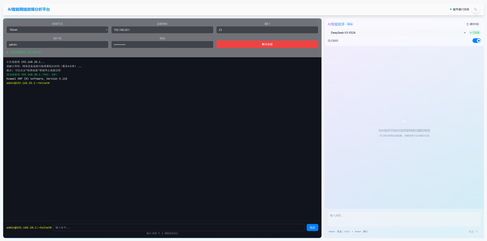
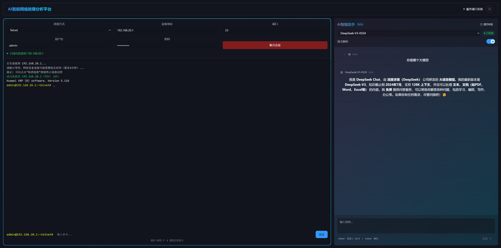

# AI智能网络故障分析平台

本项目是一个结合AI与网络管理的智能平台，用于连接网络设备并提供AI辅助的故障分析功能。系统支持多种大语言模型（Claude、GPT、Deepseek等）进行智能分析，提供流式响应界面，实现实时网络设备连接和命令执行。

## 前端界面预览

### 默认界面


### dark界面


## 项目结构

项目由前端和后端两部分组成：

### 前端结构 (Vue 3 + TypeScript)

```
frontend/
├── .vscode/            # VS Code配置
├── lib/                # 第三方库
├── public/             # 公共静态资源
├── src/                # 源代码目录
│   ├── assets/         # 静态资源
│   ├── components/     # 组件
│   │   ├── ai-assistant/       # AI助手相关组件
│   │   │   └── AIAssistant.vue # AI聊天界面组件(431行)
│   │   ├── terminal/           # 终端相关组件
│   │   │   └── NetworkTerminal.vue # 网络终端组件(281行)
│   │   ├── common/             # 通用组件（包含icons等）
│   │   └── ChatMessage.jsx     # 聊天消息组件(254行)
│   ├── composables/    # 可组合函数
│   ├── layouts/        # 布局组件
│   ├── stores/         # Pinia状态管理
│   │   ├── aiAssistant.ts      # AI助手状态管理(469行)
│   │   ├── terminal.ts         # 终端会话状态管理(234行)
│   │   └── app.ts              # 应用全局状态管理(46行)
│   ├── types/          # TypeScript类型定义
│   ├── utils/          # 工具函数
│   ├── views/          # 页面视图组件
│   ├── App.vue         # 应用主组件
│   └── main.ts         # 应用入口
├── index.html          # HTML入口
├── package.json        # 依赖配置
├── tailwind.config.js  # Tailwind CSS配置
├── tsconfig.json       # TypeScript配置
└── vite.config.ts      # Vite构建工具配置
```

### 后端结构 (FastAPI + Python)

```
backend/
├── app/                # 主应用目录
│   ├── api/            # API路由
│   │   └── api_v1/     # V1版本API
│   │       └── endpoints/       # API端点
│   │           ├── ai.py        # AI助手相关接口(268行)
│   │           ├── health.py    # 健康检查接口(43行)
│   │           ├── network.py   # 网络设备连接接口(75行)
│   │           └── terminal.py  # 终端会话管理接口(90行)
│   ├── core/           # 核心功能
│   │   ├── telnet.py           # Telnet连接实现(1295行)
│   │   ├── ssh.py              # SSH连接实现(432行)
│   │   ├── ssh_with_pagination.py # 支持分页的SSH实现(377行)
│   │   └── terminal.py         # 终端管理(260行)
│   ├── models/         # 数据模型
│   ├── services/       # 业务服务层
│   │   ├── ai_service.py       # AI服务实现(981行)
│   │   ├── deepseek_service.py # Deepseek AI服务实现(622行)
│   │   ├── network_service.py  # 网络服务实现(208行)
│   │   └── terminal_service.py # 终端服务实现(171行)
│   ├── utils/          # 工具函数
│   ├── config/         # 配置
│   │   └── settings.py # 设置参数
│   ├── main.py         # 应用主入口(96行)
│   └── config.py       # 主配置文件(56行)
├── run.py              # 启动脚本(131行)
├── requirements.txt    # 后端依赖配置
└── venv/               # Python虚拟环境
```

## 功能特点

- **网络连接**：
  - 支持SSH和Telnet协议连接到各种网络设备
  - 针对华为等特定设备的优化连接方式
  - 安全的凭证管理
  - 连接状态实时显示
  - 连接会话的自动清理机制
  
- **命令执行**：
  - 远程执行网络命令并获取结果
  - 命令历史记录（上下键浏览）
  - 命令执行状态实时反馈
  - 支持各种网络设备专用命令
  - 针对设备类型的智能命令处理
  
- **AI分析**：
  - 多种大型语言模型智能分析支持：
    - Claude (Anthropic)
    - GPT (OpenAI)
    - Deepseek
  - 网络日志和配置智能解析
  - 故障模式识别和解决方案推荐
  - 专业网络知识的上下文理解
  
- **流式响应**：
  - AI回复实时流式显示
  - 流式/非流式模式切换
  - 实时响应状态指示
  
- **多主题**：
  - 响应式设计，适配多种设备尺寸
  - 支持明暗主题切换
  - 终端样式自定义
  
- **终端会话**：
  - 支持多终端会话管理
  - 会话超时控制和自动清理
  - 终端输出实时显示
  - 丰富的终端格式化支持（错误/成功提示）
  
- **安全认证**：
  - JWT认证系统保障安全访问
  - 密码安全加密存储
  - API访问控制

## 技术栈

### 前端

- **框架**：Vue 3.3+ + TypeScript 5.2+
- **UI**：Inspira UI + TailwindCSS 3.3+
- **状态管理**：Pinia 2.1+
- **构建工具**：Vite 5.0+
- **HTTP客户端**：Axios 1.6+
- **工具库**：
  - VueUse 10.7+
  - clsx 2.0+
  - tailwind-merge 2.0+
  - class-variance-authority 0.7+
  - tailwindcss-animate 1.0+

### 后端

- **框架**：FastAPI 0.104+ + Pydantic 2.4+
- **服务器**：Uvicorn 0.23+
- **网络工具**：
  - Paramiko 3.3+ (SSH连接)
  - Netmiko 4.2+ (网络设备连接)
- **AI集成**：
  - Anthropic API (Claude)
  - OpenAI API (GPT)
  - Deepseek API
- **异步处理**：
  - aiohttp 3.8+
  - sse-starlette 1.6+ (服务器发送事件)
- **HTTP客户端**：
  - aiohttp 3.8+
  - httpx 0.24+
  - requests 2.31+
- **安全**：
  - python-jose 3.3+ (JWT)
  - passlib 1.7+ (密码)
  - bcrypt 4.0+
- **环境配置**：python-dotenv 1.0+

## 快速开始

### 后端

```bash
cd backend

# 创建虚拟环境
python -m venv venv

# 激活虚拟环境
# Windows
.\venv\Scripts\activate
# Linux/Mac
source venv/bin/activate

# 安装依赖
pip install -r requirements.txt

# 配置.env文件
cp .env.example .env
# 编辑.env文件，设置API密钥等

# 启动服务器
python run.py
```

### 前端

```bash
cd frontend

# 安装依赖
npm install

# 开发模式启动
npm run dev

# 构建生产版本
npm run build
```

## 环境变量配置

后端支持以下主要环境变量：

- `APP_ENV`: 应用环境 (development/production)
- `AI_ENABLED`: 是否启用AI功能
- `ANTHROPIC_API_KEY`: Claude API密钥
- `CLAUDE_MODEL_VERSION`: Claude模型版本
- `OPENAI_API_KEY`: OpenAI API密钥
- `DEEPSEEK_API_KEY`: Deepseek API密钥
- `SECRET_KEY`: 应用密钥
- `JWT_ACCESS_TOKEN_EXPIRE_MINUTES`: JWT令牌过期时间
- `MAX_TERMINAL_SESSIONS`: 最大终端会话数
- `SESSION_IDLE_TIMEOUT`: 会话闲置超时时间(秒)
- `HOST`: 监听主机地址（默认: 0.0.0.0）
- `PORT`: 监听端口（默认: 8000）
- `LOG_LEVEL`: 日志级别

## 访问应用

- 前端：默认运行在 http://localhost:5173
- 后端API：默认运行在 http://localhost:8000
- API文档：http://localhost:8000/api/v1/docs

## 项目API接口

### 主要API端点

#### 健康检查
- `GET /api/v1/health`: 应用和依赖服务健康检查

#### 网络设备管理
- `POST /api/v1/network/connect`: 建立网络设备连接
- `POST /api/v1/network/command`: 执行网络命令
- `POST /api/v1/network/disconnect`: 断开设备连接
- `GET /api/v1/network/connections`: 获取所有当前连接
- `GET /api/v1/network/connections/{connection_id}`: 获取特定连接状态

#### 终端会话管理
- `GET /api/v1/terminal/sessions`: 获取终端会话列表
- `POST /api/v1/terminal/sessions`: 创建终端会话
- `DELETE /api/v1/terminal/sessions/{session_id}`: 删除特定会话

#### AI助手
- `GET /api/v1/ai/models`: 获取可用AI模型列表
- `GET /api/v1/ai/models/{model_id}/status`: 检查模型连接状态
- `POST /api/v1/ai/chat`: 非流式AI对话接口
- `POST /api/v1/ai/chat/stream`: 流式AI对话接口
- `POST /api/v1/ai/deepseek/analyze-network-log`: 网络日志深度分析
- `GET /api/v1/ai/deepseek/status`: 检查Deepseek连接状态
- `POST /api/v1/ai/deepseek/generate`: 使用Deepseek生成文本

## 组件分析

### 前端主要组件

- **AIAssistant.vue**: 实现了AI对话界面，支持流式响应，多种模型切换，历史记录管理等
- **NetworkTerminal.vue**: 实现了网络设备连接终端，支持SSH/Telnet协议，命令执行和显示，历史命令等
- **状态管理**: 使用Pinia实现了AI助手、终端会话和应用全局状态的管理
- **响应式设计**: 全部组件支持响应式布局，适配多种设备尺寸

### 后端核心模块

- **telnet.py**: 针对网络设备的高级Telnet实现，包含特定设备类型的优化（如华为设备专用连接方法）
- **ssh.py/ssh_with_pagination.py**: SSH连接的实现，支持分页显示和命令执行
- **ai_service.py**: 集成多种AI模型的服务实现，支持Claude、GPT和自定义模型
- **deepseek_service.py**: 专门针对Deepseek AI的服务实现，提供网络日志分析等高级功能
- **network_service.py**: 网络设备连接和命令执行的服务层实现

## 开发说明

### 后端开发

后端使用FastAPI框架，采用RESTful API设计风格。主要文件包括：
- `app/main.py`: 应用主入口，包含FastAPI实例创建和中间件配置
- `app/api/api_v1/endpoints/`: 包含所有API端点处理函数
- `run.py`: 服务器启动脚本，处理命令行参数和环境变量

系统实现了定期清理闲置会话的后台任务，以及完善的异常处理和日志记录机制。

### 前端开发

前端使用Vue 3的组合式API和基于TypeScript的类型系统。主要包括：
- `stores/`: Pinia状态管理，分离AI助手、终端和应用全局状态
- `components/ai-assistant/AIAssistant.vue`: AI对话界面，支持多模型选择和流式响应
- `components/terminal/NetworkTerminal.vue`: 网络终端界面，支持SSH/Telnet连接和命令执行
- 响应式布局设计，支持多种设备尺寸
- 组件化结构，便于维护和扩展

## 许可证

[MIT](LICENSE) 