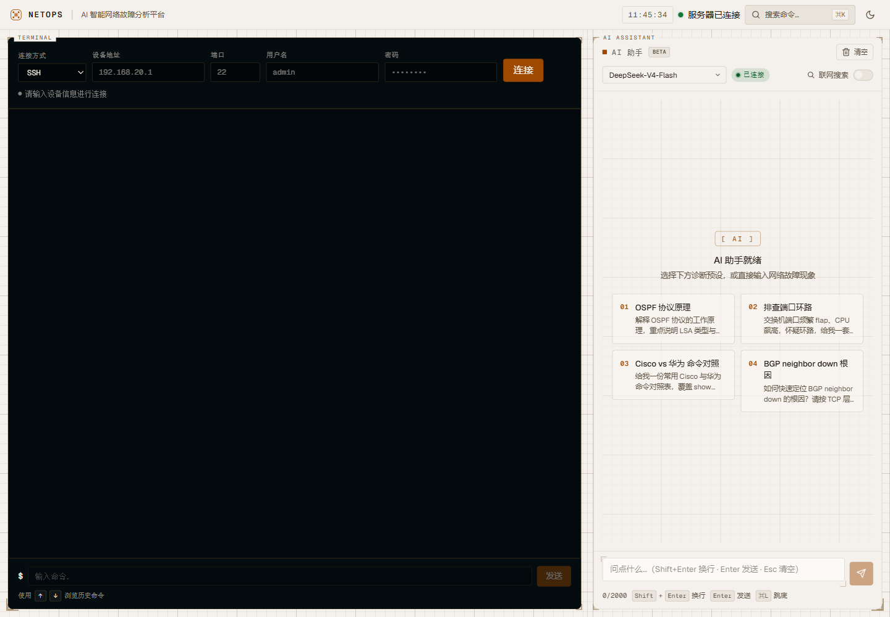
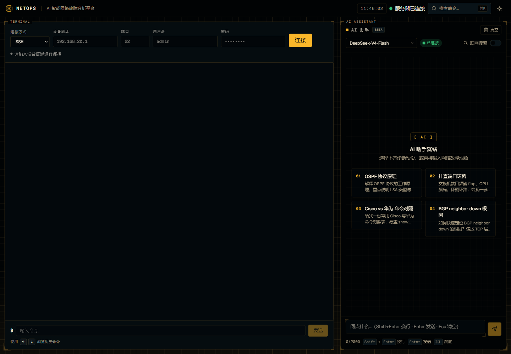

# AI智能网络故障分析平台

本项目是一个结合AI与网络管理的智能平台，用于连接网络设备并提供AI辅助的故障分析功能。系统支持多种大语言模型（Claude、GPT、Deepseek等）进行智能分析，提供流式响应界面，实现实时网络设备连接和命令执行。

## 前端界面预览

### 默认界面


### dark界面


## 项目结构

项目由前端和后端两部分组成：

### 前端结构 (Vue 3.5+ + TypeScript 5.8+)

```
frontend/
├── .vscode/                          # VS Code 配置
├── lib/                              # 第三方库和工具
│   └── utils.ts                      # 通用工具函数
├── public/                           # 公共静态资源
├── src/
│   ├── assets/
│   │   ├── main.css                  # 入口（≤ 20 行），仅 @import 子模块
│   │   └── styles/                   # P1 拆分的样式子模块
│   │       ├── tokens.css            # OKLCH 色 / 间距 / 动效 / 字体 / Z 轴 token
│   │       ├── base.css              # reset / focus-visible / reduced-motion
│   │       ├── surfaces.css          # glass-effect / shadow-glow / btn-glow
│   │       ├── terminal.css          # 终端命名空间样式
│   │       └── ai.css                # AI 对话命名空间样式
│   ├── components/
│   │   ├── ai-assistant/
│   │   │   ├── AIAssistant.vue       # 壳（~115 行），仅装配
│   │   │   └── components/           # 5 个子组件
│   │   │       ├── ChatHeader.vue
│   │   │       ├── ChatInput.vue
│   │   │       ├── ChatMessages.vue
│   │   │       ├── ModelSelector.vue
│   │   │       ├── StreamToggle.vue
│   │   │       └── index.ts
│   │   ├── terminal/
│   │   │   ├── NetworkTerminal.vue   # 壳（~35 行），仅装配
│   │   │   ├── components/           # 4 个子组件
│   │   │   │   ├── TerminalConnectionForm.vue
│   │   │   │   ├── TerminalOutput.vue
│   │   │   │   ├── TerminalCommandInput.vue
│   │   │   │   ├── TerminalStatusBar.vue
│   │   │   │   └── index.ts
│   │   │   └── composables/          # 2 个本地 composable
│   │   │       ├── useTerminalLineStyle.ts
│   │   │       └── useCommandHistory.ts
│   │   ├── common/
│   │   │   ├── ServerStatusIndicator.vue  # 使用 useIntervalFn，无 timer 泄漏
│   │   │   └── icons/                # SunIcon / MoonIcon / Send / Clear / Connect / Disconnect
│   │   └── ui/
│   │       ├── CardSpotlight.vue
│   │       ├── FloatingParticlesBackground.vue  # 纯 CSS 动画 + prefers-reduced-motion
│   │       └── ShimmerButton.vue
│   ├── composables/                  # 跨组件全局 composable
│   │   ├── useAiKeyboard.ts          # Ctrl/Cmd+K 清空对话
│   │   ├── useAutoResizeTextarea.ts
│   │   └── useChatScroll.ts
│   ├── layouts/MainLayout.vue
│   ├── stores/
│   │   ├── ai-assistant/             # AI 助手 store 拆分模块
│   │   ├── terminal.ts
│   │   └── app.ts
│   ├── types/
│   │   ├── index.ts
│   │   └── chat.ts                   # ChatMessage / ChatSettings 等单一类型源头
│   ├── utils/
│   │   ├── aiService.ts
│   │   ├── terminalService.ts
│   │   ├── localStorageUtils.ts
│   │   ├── helpers.ts
│   │   └── logger.ts                 # 分级日志器（debug/info/warn/error + traceId）
│   ├── App.vue
│   ├── main.ts                       # 仅 import './assets/main.css'
│   └── vite-env.d.ts
├── .env.example                      # 环境变量样例
├── index.html
├── package.json
├── package-lock.json
├── eslint.config.js                  # ESLint 9 flat config
├── postcss.config.js                 # 仅 @tailwindcss/postcss
├── tsconfig.json
└── vite.config.ts                    # alias / proxy / build manualChunks + sourcemap
```

### 后端结构 (FastAPI 0.115+ + Python 3.9+)

```
backend/
├── app/                        # 主应用目录
│   ├── api/                    # API路由层
│   │   ├── api_v1/            # V1版本API
│   │   │   ├── api.py         # API路由汇总
│   │   │   └── endpoints/      # API端点实现
│   │   │       ├── ai.py      # AI助手接口
│   │   │       ├── health.py  # 健康检查接口
│   │   │       ├── network.py # 网络设备接口
│   │   │       └── terminal.py # 终端会话接口
│   │   └── deps.py            # 依赖注入
│   ├── core/                   # 核心功能模块
│   │   ├── network/           # 网络连接核心
│   │   │   ├── base.py        # 网络连接基类
│   │   │   ├── telnet/        # Telnet协议实现
│   │   │   │   ├── connection.py    # Telnet连接管理
│   │   │   │   ├── manager.py       # Telnet管理器
│   │   │   │   ├── protocols.py     # Telnet协议处理
│   │   │   │   └── devices/         # 特定设备支持
│   │   │   │       └── huawei.py    # 华为设备专用
│   │   │   └── __init__.py
│   │   ├── telnet.py          # Telnet兼容性适配器
│   │   ├── ssh.py             # SSH连接实现
│   │   └── terminal.py        # 终端管理核心
│   ├── services/               # 业务服务层
│   │   ├── ai/                # AI服务模块
│   │   │   ├── base.py        # AI服务基类
│   │   │   ├── manager.py     # AI服务管理器
│   │   │   ├── providers/     # AI服务提供商
│   │   │   │   ├── openai_provider.py   # OpenAI提供商
│   │   │   │   ├── claude_provider.py   # Claude提供商
│   │   │   │   └── deepseek_provider.py # Deepseek提供商
│   │   │   └── deepseek/      # Deepseek专用模块
│   │   │       ├── client.py  # Deepseek客户端
│   │   │       └── analyzer.py # 网络日志分析器
│   │   ├── deepseek_service.py # Deepseek服务实现
│   │   ├── network_service.py  # 网络设备服务
│   │   └── terminal_service.py # 终端会话服务
│   ├── models/                 # 数据模型定义
│   │   ├── ai.py              # AI相关模型
│   │   ├── network.py         # 网络设备模型
│   │   └── terminal.py        # 终端会话模型
│   ├── utils/                  # 工具函数库
│   │   ├── logger.py          # 日志管理
│   │   ├── security.py        # 安全工具
│   │   └── model_config.py    # 模型配置工具
│   ├── config/                 # 配置管理
│   │   └── settings.py        # 应用设置
│   └── main.py                 # FastAPI应用入口
├── run.py                      # 服务器启动脚本
├── pyproject.toml              # 现代Python项目配置
├── uv.lock                     # UV依赖锁定文件
├── .env.example                # 环境变量示例
├── .env                        # 环境变量配置
└── .venv/                      # Python虚拟环境
```

### 脚本目录结构

```
scripts/
├── dev.ps1                 # Windows 开发环境统一启动脚本
├── prod.ps1                # Windows 生产环境统一启动脚本
├── build.ps1               # Windows 前端生产构建 + dist 体积统计
├── lint.ps1                # Windows typecheck + ESLint（--Fix 走 lint:fix）
├── clean-python-cache.ps1  # Windows Python 缓存清理脚本
├── dev.sh                  # Linux/Mac 开发环境统一启动脚本
├── prod.sh                 # Linux/Mac 生产环境统一启动脚本
├── build.sh                # Linux/Mac 前端生产构建 + dist 体积统计
├── lint.sh                 # Linux/Mac typecheck + ESLint（--fix 走 lint:fix）
├── clean-python-cache.sh   # Linux/Mac Python 缓存清理脚本
└── p3_axe_audit.py         # P3 a11y 验证：Playwright + axe-core 自动审计
```

### 日志目录结构

```
logs/
├── backend/            # 后端日志目录
│   ├── backend-2025-09-10.log  # 按日期自动归档的后端日志
│   └── backend-YYYY-MM-DD.log  # 每日日志文件
├── app/                # 应用日志目录
├── access/             # 访问日志目录
├── error/              # 错误日志目录
└── frontend/           # 前端日志目录
```

## 功能特点

### 网络连接与设备管理
- **多协议支持**：支持SSH和Telnet协议连接到各种网络设备
- **智能设备识别**：自动检测目标端口协议类型，防止协议错配
- **专用设备支持**：针对华为等特定设备的优化连接方式
- **安全凭证管理**：支持密码加密存储，保障连接安全
- **连接状态监控**：实时显示连接状态和连接时间
- **会话自动管理**：定时清理闲置会话，支持会话超时配置

### 命令执行与终端管理
- **远程命令执行**：安全执行网络设备命令并获取结果
- **命令历史记录**：支持上下键浏览历史命令，提高操作效率
- **实时状态反馈**：命令执行状态实时显示，支持进度指示
- **设备命令智能处理**：针对不同设备类型的智能命令处理和格式化
- **多终端会话**：支持同时管理多个网络设备连接会话
- **终端输出美化**：丰富的终端格式化支持（错误/成功提示）

### AI智能分析系统
- **多模型智能分析**：支持多种大型语言模型：
  - **Claude (Anthropic)**：Claude Opus 4.7 / Sonnet 4.6 / Haiku 4.5 系列
  - **GPT (OpenAI)**：GPT-5.5 与 GPT-5.4 Mini 等先进模型
  - **DeepSeek**：DeepSeek-V4-Pro / V4-Flash 系列，支持推理和高性价比分析
- **专业网络分析**：网络日志和配置智能解析，故障模式识别
- **解决方案推荐**：基于专业网络知识的上下文理解和问题解决
- **模型状态监控**：实时检测各AI模型连接状态
- **自适应模型选择**：根据可用性自动选择最优AI模型

### 流式响应与交互体验
- **实时流式对话**：AI 回复实时 SSE 流式显示（Server-Sent Events），唯一对话接口
- **实时响应状态**：显示打字动画和响应进度指示
- **消息历史管理**：支持本地存储和聊天记录管理

### 响应式设计与主题系统
- **现代化UI设计**：基于 Tailwind CSS v4 与 OKLCH 设计 token，差异化的"工程师终端审美"与"AI 对话 conversational 审美"
- **响应式布局**：适配多种设备尺寸，支持桌面和移动端
- **主题系统**：支持明暗主题切换，系统偏好自动适配
- **高级动效**：聚光灯卡片、浮动粒子背景、波纹按钮等高级UI组件
- **玻璃态效果**：高级背景模糊和玻璃态设计元素

### 安全认证与权限管理
- **JWT认证系统**：保障安全访问，支持令牌过期管理
- **密码安全加密**：采用bcrypt加密存储敏感信息
- **API访问控制**：CORS配置和请求限制管理
- **环境变量隔离**：敏感配置信息与代码分离管理

## 技术栈

### 前端技术栈

- **核心框架**：Vue 3.5.13+ · TypeScript 5.8.3+（strict）
- **状态管理**：Pinia 2.3.1+
- **构建工具**：Vite 6.0+（manualChunks: vue / markdown / vendor + esbuild + sourcemap）
- **HTTP 客户端**：Axios 1.9.0+
- **UI / 样式**：
  - Tailwind CSS 4.0+（含内置 autoprefixer，不再单独依赖）
  - @tailwindcss/postcss 4.1.13+（v4 唯一需要的 PostCSS 插件）
  - tw-animate-css 1.3.8+
- **组合式工具**：VueUse 11.0+（含 useIntervalFn 等）
- **Markdown 安全**：marked 16.2.1+ · DOMPurify 3+（在 `ChatMessages.vue` 内净化 XSS）
- **工具库**：clsx 2.0+ · tailwind-merge 2.6+

### 后端技术栈

- **核心框架**：FastAPI 0.115.12+ · Python 3.9+
- **异步服务器**：Uvicorn 0.34.2+ (高性能 ASGI 服务器)
- **数据验证**：
  - Pydantic 2.11.4+ (现代数据验证库)
  - pydantic-settings 2.9.1+ (设置管理)
- **网络工具**：
  - Paramiko 3.5.1+ (SSH连接库)
  - Netmiko 4.5.0+ (网络设备连接库)
- **AI集成**：
  - Anthropic API (Claude Opus 4.7 / Sonnet 4.6 / Haiku 4.5 系列)
  - OpenAI API (GPT-5.5 / GPT-5.4 Mini 等先进模型)
  - DeepSeek API (DeepSeek-V4-Pro / V4-Flash 系列)
- **异步处理**：
  - aiohttp 3.11.18+ (异步HTTP客户端)
  - sse-starlette 1.6.5+ (服务器发送事件)
- **HTTP客户端**：
  - httpx 0.28.1+ (现代异步HTTP客户端)
  - requests 2.32.3+ (传统HTTP客户端)
- **安全组件**：
  - python-jose 3.4.0+ (JWT 令牌处理)
  - passlib 1.7.4+ (密码哈希库)
  - bcrypt 4.3.0+ (密码加密)
- **环境管理**：python-dotenv 1.1.0+ (环境变量管理)

### 开发工具与测试

#### 前端开发工具
- **代码质量**：ESLint 9.0+ flat config · vue-tsc 2.0+ 类型检查
- **自动化工具**：
  - @typescript-eslint/eslint-plugin 8.0+
  - @vue/eslint-config-typescript 14.0+
  - eslint-plugin-vue 9.28+
- **样式与构建**：
  - postcss 8.4.31+（仅作为 @tailwindcss/postcss 的宿主，v4 已内置 autoprefixer 能力）
  - Tailwind CSS v4（无 tailwind.config，配置走 `@theme inline` 与 CSS token）

#### 后端开发工具
- **代码质量**：
  - Black 23.0+ (代码格式化)
  - Ruff 0.1+ (高性能 Linter)
  - MyPy 1.0+ (静态类型检查)
- **测试框架**：
  - pytest 8.4.2+ (现代测试框架)
  - pytest-asyncio 1.1.0+ (异步测试支持)
  - pytest-cov 6.3.0+ (测试覆盖率)
- **现代依赖管理**：uv (高性能 Python 包管理器)

## 快速开始

### Windows PowerShell 启动（推荐）

Windows 用户只需要使用两个统一入口。脚本会先弹出后端窗口，
等待 `/api/v1/health` 健康检查通过后，再弹出前端窗口。

```powershell
# 开发环境：后端热重载 + 前端 Vite dev server
.\scripts\dev.ps1

# 自定义端口
.\scripts\dev.ps1 -BackendPort 8080 -FrontendPort 5181

# 生产环境：后端非热重载 + 前端 preview
.\scripts\prod.ps1

# 生产环境强制重新构建前端资源
.\scripts\prod.ps1 -RebuildFrontend

# 清理已有 Python 字节码缓存
.\scripts\clean-python-cache.ps1
```

#### PowerShell 启动脚本特性

- **顺序启动**：后端窗口启动并通过健康检查后，才启动前端窗口
- **路径稳定**：脚本基于自身位置定位项目根目录，可从任意目录调用
- **基础检查**：自动检查 `backend/.env`、`uv`、`npm` 和日志目录
- **依赖兜底**：前端缺少 `node_modules` 时会在前端窗口内自动安装依赖
- **缓存控制**：后端启动窗口会设置 `PYTHONDONTWRITEBYTECODE=1`，避免生成
  `__pycache__` 目录和 `.pyc/.pyo` 文件

### 后端部署（推荐 uv 工具）

#### 使用现代化 uv 工具部署（推荐）

```bash
cd backend

# 1. 创建虚拟环境（使用现代化 uv 工具）
uv venv .venv

# 2. 激活虚拟环境
# Windows
.venv\Scripts\activate
# Linux/Mac
source .venv/bin/activate

# 3. 安装依赖（推荐方式，自动安装所有项目依赖）
uv pip install -e .

# 或者手动安装所有核心依赖：
uv pip install fastapi==0.115.12 uvicorn==0.34.2 pydantic==2.11.4 \
  pydantic-settings==2.9.1 sse-starlette==1.6.5 netmiko==4.5.0 \
  aiohttp==3.11.18 python-dotenv==1.1.0 httpx==0.28.1 \
  paramiko==3.5.1 python-jose==3.4.0 passlib==1.7.4 \
  bcrypt==4.3.0 requests==2.32.3

# 4. 验证环境
uv run python -c "import fastapi, uvicorn, pydantic; print('核心依赖已安装')"

# 5. 配置环境变量
cp .env.example .env
# 编辑.env文件，设置API密钥等

# 6. 回到项目根目录，使用统一启动脚本
cd ..
./scripts/dev.sh

# 生产环境启动
./scripts/prod.sh
```

#### Linux/Mac 传统部署方式

```bash
cd backend

# 创建虚拟环境
python -m venv .venv

# 激活虚拟环境
# Windows
.\.venv\Scripts\activate
# Linux/Mac
source .venv/bin/activate

# 安装依赖（传统方式）
pip install -r requirements.txt

# 配置.env文件
cp .env.example .env
# 编辑.env文件，设置API密钥等

# 启动服务器
python run.py
```

### 前端

推荐通过根目录脚本驱动，避免直接调用 npm 底层命令（对齐全局 Layer 4.1）：

```powershell
# Windows
.\scripts\dev.ps1       # 后端 + 前端联动启动
.\scripts\build.ps1     # 生产构建 + dist 体积统计
.\scripts\lint.ps1      # typecheck + ESLint
.\scripts\lint.ps1 -Fix # typecheck + ESLint --fix
```

```bash
# Linux / Mac / Git Bash
./scripts/dev.sh
./scripts/build.sh
./scripts/lint.sh
./scripts/lint.sh --fix
```

需要直接调用底层命令时（不推荐）：

```bash
cd frontend
npm install
npm run dev        # vite dev server
npm run build      # vue-tsc && vite build
npm run typecheck  # vue-tsc --noEmit
npm run lint       # eslint .
```

前端环境变量样例见 `frontend/.env.example`，复制为 `.env.local` 后填值（被
`.gitignore` 排除，不会进入版本控制）。当前代码唯一消费的是 `VITE_INTERNAL_API_TOKEN`，
需与后端 `INTERNAL_API_TOKEN` 一致。

## 环境变量配置

后端支持以下主要环境变量：

- `APP_ENV`: 应用环境 (development/production)
- `AI_ENABLED`: 是否启用AI功能
- `ANTHROPIC_API_KEY`: Claude API密钥
- `CLAUDE_MODEL_VERSION`: Claude模型版本
- `OPENAI_API_KEY`: OpenAI API密钥
- `DEEPSEEK_API_KEY`: Deepseek API密钥
- `SECRET_KEY`: 应用密钥
- `API_AUTH_ENABLED`: 内部 API 鉴权开关；生产环境必须为 `true`
- `INTERNAL_API_TOKEN`: 内部接口 Bearer Token，需与前端 `VITE_INTERNAL_API_TOKEN` 一致
- `JWT_ACCESS_TOKEN_EXPIRE_MINUTES`: JWT令牌过期时间
- `MAX_TERMINAL_SESSIONS`: 最大终端会话数
- `SESSION_IDLE_TIMEOUT`: 会话闲置超时时间(秒)
- `TERMINAL_ALLOWED_HOSTS`: 可选，逗号分隔允许连接的设备主机名或 IP
- `TERMINAL_ALLOWED_CIDRS`: 可选，逗号分隔允许连接的设备网段
- `TERMINAL_ALLOWED_SSH_PORTS`: SSH 允许端口，默认 `22,2222`
- `TERMINAL_ALLOWED_TELNET_PORTS`: Telnet 允许端口，默认 `23,2323`
- `TERMINAL_COMMAND_MAX_LENGTH`: 终端命令最大长度，默认 `256`
- `TERMINAL_BLOCKED_COMMAND_PATTERNS`: 高风险终端命令拦截正则列表
- `HOST`: 监听主机地址（默认: 0.0.0.0）
- `PORT`: 监听端口（默认: 8000）
- `LOG_LEVEL`: 日志级别

**API 前缀配置（后端与前端代理）**
- 后端前缀：通过 `API_PREFIX` 设置 API 根前缀（默认 `\/api`）。若未显式设置 `API_V1_STR`，后端会自动计算为 `\${API_PREFIX}/v1`。
- 优先级：如同时设置了 `API_V1_STR`，将优先生效，直接作为版本化前缀使用。
- 示例（后端 .env）：
  - `API_PREFIX=/backend`
  - `# 可选覆盖：API_V1_STR=/backend/v1`
- 前端代理两种做法（开发模式）：
  - 方案A（推荐，前端 axios 保持 `baseURL: '/api'` 不变）：在 `frontend/vite.config.ts` 将 `rewrite` 映射到后端新前缀：
    ```ts
    proxy: {
      '/api': {
        target: 'http://localhost:8000',
        changeOrigin: true,
        // 若后端设置 API_PREFIX=/backend，则：
        rewrite: (path) => path.replace(/^\/api/, '/backend/v1')
      }
    }
    ```
  - 方案B（同步修改前端 baseURL）：把前端 axios `baseURL` 改为 `'/backend'`，并在代理中：
    ```ts
    proxy: {
      '/backend': {
        target: 'http://localhost:8000',
        changeOrigin: true,
        rewrite: (path) => path.replace(/^\/backend/, '/backend/v1')
      }
    }
    ```
  - 二选一即可，关键是让开发代理把“未版本的前缀”重写到“版本化前缀”。

## 访问应用

- 前端：默认运行在 http://localhost:5180
- 后端API：默认运行在 http://localhost:8000
- API文档：http://localhost:8000/api/v1/docs

## 故障排除

### Windows PowerShell 脚本故障排除

Windows 用户统一使用 `dev.ps1` 和 `prod.ps1`。两个脚本都会先启动后端
窗口，并在健康检查通过后启动前端窗口。

#### 启动问题

```powershell
# 开发环境基本诊断
.\scripts\dev.ps1

# 如果遇到端口占用问题
.\scripts\dev.ps1 -BackendPort 8080 -FrontendPort 5181

# 生产环境基本诊断
.\scripts\prod.ps1

# 生产环境强制重新构建前端资源
.\scripts\prod.ps1 -RebuildFrontend

# 检查 PowerShell 执行策略
Get-ExecutionPolicy
# 如果受限，临时允许脚本执行
Set-ExecutionPolicy -Scope CurrentUser -ExecutionPolicy RemoteSigned
```

#### PowerShell 权限问题

如果遇到 **ExecutionPolicy** 错误：
```powershell
# 方案1：临时绕过执行策略
powershell -ExecutionPolicy Bypass -File ".\scripts\dev.ps1"

# 方案2：为当前用户设置执行策略
Set-ExecutionPolicy -Scope CurrentUser -ExecutionPolicy RemoteSigned

# 方案3：查看当前策略状态
Get-ExecutionPolicy -List
```

### Linux/Mac 后端启动问题

如果遇到 **ModuleNotFoundError: No module named 'uvicorn'** 或其他模块缺失错误：
```bash
# 方案1：使用 uv 重新安装所有依赖
cd backend
uv pip install fastapi uvicorn pydantic pydantic-settings sse-starlette netmiko aiohttp python-dotenv httpx paramiko python-jose passlib bcrypt requests

# 方案2：验证虚拟环境激活状态
source .venv/bin/activate  # Linux/Mac
.venv/Scripts/activate     # Windows

# 方案3：检查依赖安装状态
uv pip list

# 启动时必须使用 uv run 或激活虚拟环境后启动
uv run python run.py --reload
```

如果遇到 **Pydantic 验证错误** 或 **AIModel 字段错误**：
```bash
# 确保使用了正确的依赖版本
uv pip install --upgrade pydantic fastapi

# 检查环境变量配置
cat .env.example  # 参考正确的环境变量格式
```

如果遇到 **虚拟环境问题**：
```bash
# 重新创建虚拟环境
rm -rf .venv
uv venv .venv
source .venv/Scripts/activate
uv pip install fastapi uvicorn pydantic pydantic-settings sse-starlette netmiko aiohttp python-dotenv httpx paramiko python-jose passlib bcrypt requests
```

如果遇到 **启动脚本权限问题**：
```bash
# 设置脚本执行权限
chmod +x scripts/*.sh

# 使用正确的脚本启动
./scripts/dev.sh          # 开发环境
./scripts/prod.sh         # 生产环境

# 清理已有 Python 字节码缓存
./scripts/clean-python-cache.sh
```

**重要提示**：
- 项目已配置日志输出到 `logs/backend/backend-YYYY-MM-DD.log` 文件（按日期自动归档）
- **Windows 用户推荐使用 PowerShell 脚本**：
  - 开发环境：`.\scripts\dev.ps1`
  - 生产环境：`.\scripts\prod.ps1`
- **Linux/Mac 用户推荐使用 Shell 脚本**：
  - 开发环境：`./scripts/dev.sh`
  - 生产环境：`./scripts/prod.sh`
- 统一启动脚本会禁用 Python 字节码缓存写入；已有缓存可通过
  `.\scripts\clean-python-cache.ps1` 或 `./scripts/clean-python-cache.sh` 清理
- 确保使用 `uv run` 命令或激活虚拟环境后启动

如果遇到 **中文字符乱码**：
- 确保终端使用 UTF-8 编码
- Windows 用户建议使用 PowerShell 或 Git Bash

### 前端启动问题

如果遇到 **依赖安装问题**：
```bash
# 清理缓存重新安装
rm -rf node_modules package-lock.json
npm install
```

如果遇到 **TypeScript 错误**：
```bash
# 检查 TypeScript 版本兼容性
npm run typecheck
```

## 项目API接口

### 主要API端点

#### 健康检查
- `GET /api/v1/health`: 应用和依赖服务健康检查

#### 网络设备管理
- `POST /api/v1/network/connect`: 建立网络设备连接
- `POST /api/v1/network/command`: 执行网络命令
- `POST /api/v1/network/disconnect`: 断开设备连接
- `GET /api/v1/network/connections`: 获取所有当前连接
- `GET /api/v1/network/connections/{connection_id}`: 获取特定连接状态

#### 终端会话管理
- `GET /api/v1/terminal/sessions`: 获取终端会话列表
- `POST /api/v1/terminal/sessions`: 创建终端会话
- `DELETE /api/v1/terminal/sessions/{session_id}`: 删除特定会话

#### AI助手
- `GET /api/v1/ai/models`: 获取可用AI模型列表
- `GET /api/v1/ai/models/{model_id}/status`: 检查模型连接状态
- `POST /api/v1/ai/chat/stream`: AI 对话接口（SSE 流式响应，唯一对话入口）
- `POST /api/v1/ai/deepseek/analyze-network-log`: 网络日志深度分析
- `GET /api/v1/ai/deepseek/status`: 检查Deepseek连接状态

> ⚠️ **BREAKING CHANGE（2026-05-28）**：
> `POST /api/v1/ai/chat` 与 `POST /api/v1/ai/deepseek/generate` 非流式 / 双模式接口已于本版本移除。
> AI 对话请统一使用 `POST /api/v1/ai/chat/stream`（SSE 流式响应）。

## 组件分析

### 前端主要组件

- **AIAssistant.vue**: 实现了AI对话界面，使用 SSE 流式响应，多种模型切换，历史记录管理等
- **NetworkTerminal.vue**: 实现了网络设备连接终端，支持SSH/Telnet协议，命令执行和显示，历史命令等
- **状态管理**: 使用Pinia实现了AI助手、终端会话和应用全局状态的管理
- **响应式设计**: 全部组件支持响应式布局，适配多种设备尺寸

### 后端核心模块

- **telnet.py**: 针对网络设备的高级Telnet实现，包含特定设备类型的优化（如华为设备专用连接方法）
- **ssh.py**: SSH连接的实现，支持分页显示、命令执行和主机密钥策略配置
- **ai_service.py**: 集成多种AI模型的服务实现，支持Claude、GPT和自定义模型
- **deepseek_service.py**: 专门针对Deepseek AI的服务实现，提供网络日志分析等高级功能
- **network_service.py**: 网络设备连接和命令执行的服务层实现

## 开发说明

### 后端开发

后端使用FastAPI框架，采用RESTful API设计风格。主要文件包括：
- `app/main.py`: 应用主入口，包含FastAPI实例创建和中间件配置
- `app/api/api_v1/endpoints/`: 包含所有API端点处理函数
- `run.py`: 服务器启动脚本，处理命令行参数和环境变量

系统实现了定期清理闲置会话的后台任务，以及完善的异常处理和日志记录机制。

### 前端开发

前端使用Vue 3的组合式API和基于TypeScript的类型系统。主要包括：
- `stores/`: Pinia状态管理，分离AI助手、终端和应用全局状态
- `components/ai-assistant/AIAssistant.vue`: AI对话界面，支持多模型选择，使用 SSE 流式响应
- `components/terminal/NetworkTerminal.vue`: 网络终端界面，支持SSH/Telnet连接和命令执行
- 响应式布局设计，支持多种设备尺寸
- 组件化结构，便于维护和扩展

## 许可证

[MIT](LICENSE) 
